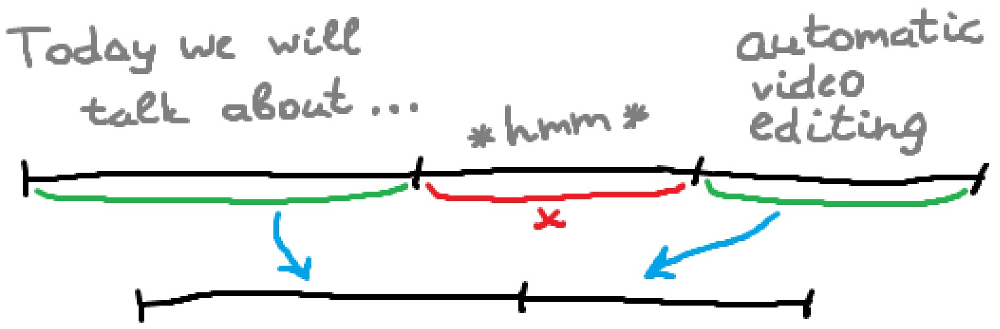

# Automatic Video Editing

Automatic video editing with Python, [moviepy](https://zulko.github.io/moviepy/) and [vosk API](https://alphacephei.com/vosk/)



## Tutorial

You can read detailed tutorial on [Medium]() or directly [on GitLab](https://gitlab.com/Winston-90/automatic_video_editing/-/blob/main/article/article.md).

## Results

See the videos:
- [Automatic Video Editing - Control Words on Youtube](https://www.youtube.com/watch?v=Y8HlXMrDBrc)
- [Automatic Video Editing - Silence on Youtube](https://www.youtube.com/watch?v=70EVCKNSsdI)

## Setup

First, you need to install moviepy and vosk libraries. You can do it with `pip install -r requirements` or `pip install moviepy vosk` command.

Next, you need to download the vosk model from [official site](https://alphacephei.com/vosk/models) and unzip it.

Next open `automatic_video_cutter.py` file with any text editor and set the parameters before calling a `main` method (in 305 line):
- `model_path` - path to unziped vosk model;
- `video_path` - path to video file to convert;
- `result_path` - new filename to save final video;
- `silence` - processing method. If True, process video with silence mode, if False - with control words;
- `threshold` - threshold of silence time in seconds. Used only if silence==True;
- `offset_silence` - offset in seconds. Used only if silence==True;
- `start_word` - control word that signals the beginning of the video fragment to be cut. Used only if silence==False;
- `end_word` - control word that signals the ending of the video fragment to be cut. Used only if silence==False;
- `offset_words` - offset in seconds. Used only if silence==False.

If you can use [Jupyter Notebook](https://jupyter.org/) you can open `automatic_video_cutter.ipynb` file and specify these parameters in **Set parameters** 14 cell. Path to the vosk model is specified earlier - in **Loading a vosk model** section, 11 cell.

## Project Structure

The project has the following structure:

```
automatic_video_editing
├───article
├───models
│   ├───vosk-model-en-us-0.21
│   └───vosk-model-ru-0.10
├───videos
│   .gitignore
│   
│   automatic_video_cutter.ipynb
│   automatic_video_cutter.py
│   Word.py
│
│   README.md
└── requirements.txt
```

It contains the following folders:
- The `article` folder contains the data for this tutorial.
- The `models` folder contains vosk models downloaded from [official site](https://alphacephei.com/vosk/models).
- The `videos` folder contains videos to be processed.
  
And code files:
- `Word.py` file describes the `Word` class.
- `automatic_video_cutter.ipynb` notebook contains a full program.
- `automatic_video_cutter.py` file contains the same full program but in the form of a python script. It can be used to run a program without [Jupyter Notebook](https://jupyter.org/).